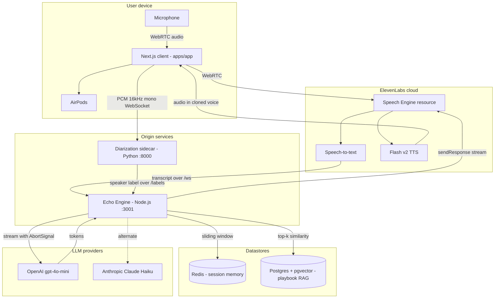
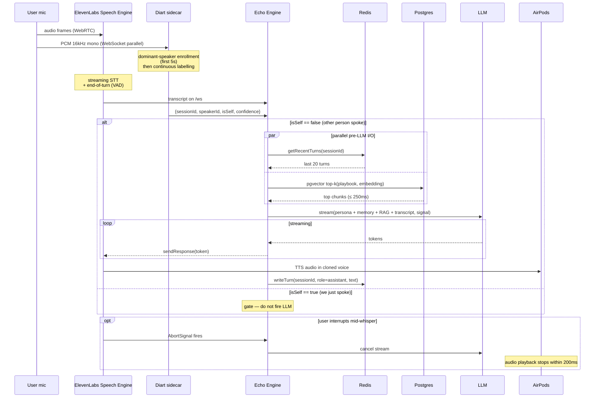
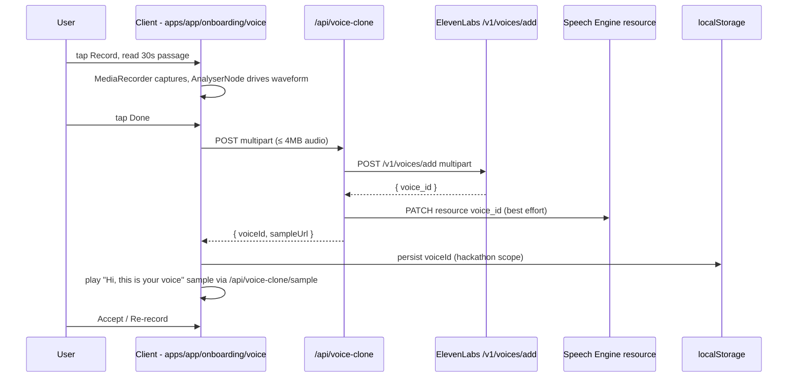
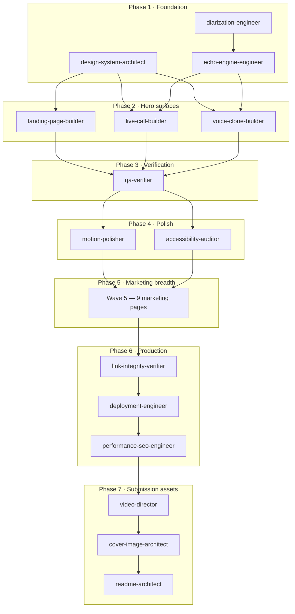

# Architecture · Vought

> A deeper companion to [`README.md`](README.md) §5. Component-by-component walkthrough of the voice loop, with file paths, scaling characteristics, and failure modes. Read this when you need to extend a service, not just understand the demo.

The canonical strategic spec is [`BLUEPRINT.md`](BLUEPRINT.md). The canonical design spec is [`VOUGHT-DESIGN-BLUEPRINT.md`](VOUGHT-DESIGN-BLUEPRINT.md). This file is the engineering view.

---

## Contents

1. [Topology](#topology)
2. [The voice loop, end to end](#the-voice-loop-end-to-end)
3. [Latency budget](#latency-budget)
4. [Service · Echo Engine](#service--echo-engine)
5. [Service · Diarization Sidecar](#service--diarization-sidecar)
6. [Service · Speech Engine (ElevenLabs)](#service--speech-engine-elevenlabs)
7. [Voice cloning lifecycle](#voice-cloning-lifecycle)
8. [Memory + RAG](#memory--rag)
9. [Data model](#data-model)
10. [Streaming and interrupt handling](#streaming-and-interrupt-handling)
11. [Failure modes](#failure-modes)
12. [Design system + motion library](#design-system--motion-library)
13. [Build system — the 11-wave agent fleet](#build-system--the-11-wave-agent-fleet)
14. [Deploy topology](#deploy-topology)

---

## Topology



*Six runtime components, three datastores, two LLM providers, two clouds. The control plane is the Echo Engine; the data plane is split between ElevenLabs (audio) and the diarization sidecar (speaker labels). Datastores are optional — the Echo Engine soft-fails to in-memory + RAG-disabled when either is unreachable.*

Source: [`vault/30 · Architecture/System Diagram.md`](<vault/30 · Architecture/System Diagram.md>).

---

## The voice loop, end to end

A single conversation turn, traced as a sequence diagram. This is the diagram engineering pauses on.



*The two notable shapes here: pre-LLM I/O is parallel (`Promise.all` on Redis + Postgres so the budget doesn't serialize the reads), and the `AbortSignal` from the ElevenLabs SDK threads all the way through the LLM call so an interruption cancels the stream cleanly.*

Source: [`vault/30 · Architecture/Echo Engine.md`](<vault/30 · Architecture/Echo Engine.md>) §"Patterns we landed on".

---

## Latency budget

Stage-by-stage, end-of-turn to whisper-in-ear:

| Stage | Budget | Owner | Knob |
|---|---|---|---|
| End-of-turn detection | 200-400ms | Diart + VAD | Lower the rolling buffer; accuracy trade-off |
| ElevenLabs STT transcript | 100-200ms | ElevenLabs | Out of our hands |
| Network hop to Echo Engine | 20-50ms | Echo Engine region | Co-locate with ElevenLabs edge (us-east-1) |
| Prompt assembly + RAG | 30-80ms | Echo Engine | `Promise.all` Redis + pgvector; hard 250ms RAG timeout |
| LLM TTFT (gpt-4o-mini) | 200-400ms | OpenAI / Anthropic | Switch to Claude Haiku; shorter prompt; warm path |
| ElevenLabs Flash TTS TTFB | ~135ms | ElevenLabs | Use Flash v2, not multilingual |
| Audio delivery to AirPods | 50-100ms | WebRTC | Browser-dependent |
| **Total** | **735-1365ms** | | p50 target ≤ 900ms |

The brand callsign `· 412ms` is the warm-path LLM-TTFT scenario on `eleven_flash_v2_5`. Capture method specified in [`vault/30 · Architecture/Latency Budget.md`](<vault/30 · Architecture/Latency Budget.md>) §"How we measure"; the test harness at `services/echo-engine/test/latency.test.ts` is open work — see Known gaps in [`README.md`](README.md).

**Interrupt budget:** end-of-user-speech detected to suggestion-faded-and-audio-stopped is ≤ 200ms. The AbortSignal fires on `onUserSpeech`, the LLM stream cancels, the TTS playback stops, the suggestion card fades to 60% opacity over 200ms, the state pill flips to Listening.

Source: [`vault/30 · Architecture/Latency Budget.md`](<vault/30 · Architecture/Latency Budget.md>).

---

## Service · Echo Engine

**Path:** [`services/echo-engine/`](services/echo-engine/) · **Port:** :3001 · **Runtime:** Node.js 20

The orchestrator. Owns the WebSocket attached to the ElevenLabs Speech Engine, the diarization label subscription, the persona-and-prompt assembly, the LLM stream, and the response forwarding back to ElevenLabs TTS.

### Module layout

```
services/echo-engine/src/
├── server.ts              Express + WS attach; AbortSignal threading; /health; /personas
├── orchestrator.ts        Pure prompt assembly — persona + memory + RAG + transcript → messages
├── speaker-gate.ts        WS subscriber to /labels; per-session cache; 5s staleness guard
├── memory.ts              Redis sliding window (last 20 turns); 1h TTL; in-memory fallback
├── rag.ts                 pgvector top-k; hard 400ms embed / 250ms query timeouts
├── voice-clone.ts         Multipart POST to /v1/voices/add; userVoiceMap
├── personas/index.ts      11-persona registry + validatePersonas() + $VARIABLE$ substitution
├── speech-engine-setup.ts Create/update Speech Engine resource
└── log.ts                 Pino structured logging
```

### Hot paths

| Endpoint | Method | Use |
|---|---|---|
| `/api/turn` | POST | Receives a transcript from the Speech Engine, runs the full pipeline, streams SSE |
| `/api/voice-clone` | POST | Accepts 30s audio, calls ElevenLabs cloning API, stores voice_id |
| `/labels` | WS (outbound) | Subscribes to the diart sidecar's label stream |
| `/health` | GET | Liveness probe; always 200 when boot succeeded |
| `/personas` | GET | Available personas for the client picker |

### Structured logging

Every hot-path stage carries `sessionId`, `stage`, and where relevant `latencyMs`. Searchable by `stage`:

| Stage | Meaning |
|---|---|
| `transcript_received` | Speech Engine pushed a new transcript |
| `speaker_gate_pass` | Other person spoke last — fire LLM |
| `speaker_gate_skip` | We just spoke — suppress |
| `llm_fire` | LLM call dispatched (`prepMs`) |
| `llm_first_token` | First token from LLM (`latencyMs` since `llm_fire`) |
| `llm_done` | Full turn finished (`totalMs` since `transcript_received`) |
| `llm_abort` | User interrupted, AbortSignal fired |
| `rag_hit` / `rag_miss` | pgvector returned chunks |
| `voice_clone_start` / `voice_clone_done` | Voice cloning lifecycle |

### Scaling characteristics

- **Stateless per request.** All session state lives in Redis. Multiple Echo Engine instances scale horizontally behind a sticky load balancer.
- **No CPU-heavy work.** The engine is I/O-bound on ElevenLabs, the LLM provider, and the datastores. ~50 concurrent sessions per 1 vCPU is the working estimate.
- **The bottleneck is the Speech Engine resource.** One `seng_…` ID maps to one wsUrl, so a horizontally-scaled deploy needs a stable public WS URL in front of the engine pool.

Source: [`vault/30 · Architecture/Echo Engine.md`](<vault/30 · Architecture/Echo Engine.md>).

---

## Service · Diarization Sidecar

**Path:** [`services/diarization-sidecar/`](services/diarization-sidecar/) · **Port:** :8000 · **Runtime:** Python 3.11 + FastAPI + uvicorn

A separate Python process whose only job is to know who is talking. The Echo Engine subscribes to its labels and uses them to gate the LLM. Running it in a sidecar (not embedded) is intentional — diart needs pyannote-audio, which needs PyTorch, which prefers GPU and ships a hefty dependency tree.

### Module layout

```
services/diarization-sidecar/
├── main.py            FastAPI + WS endpoints; sessions map; label subscribers
├── pipeline.py        diart 0.9 SpeakerDiarization + _PushableSource adapter
├── enrollment.py      5s dominant-speaker enrollment (thread-safe)
├── scripts/
│   └── prewarm_model.py  pyannote model warmup baked into Docker image
├── requirements.txt   diart 0.9.x, rx==3.2.0 pinned
└── Dockerfile         Two-stage build with BuildKit secret for HF_TOKEN
```

### Endpoints

| Endpoint | Use |
|---|---|
| `GET /health` | `{ok, active_sessions, hf_token_present, ready}`. Always 200 so deploy probes pass even when HF gating is broken. |
| `WS /audio/{session_id}` | Receives raw 16kHz mono int16 PCM, one frame per message |
| `WS /labels` | Pushes `speaker_label` events to subscribers (Echo Engine) |

### Wire format

```typescript
type SpeakerLabel = {
  type: "speaker_label";
  sessionId: string;
  tStart: number;     // seconds since session start
  tEnd: number;
  speakerId: string;  // "spk0", "spk1", …
  isSelf: boolean;    // set after 5s enrollment locks the dominant speaker
  confidence: number; // hard-coded 0.9 in diart 0.9 — see ADR-003
};
```

Pinned in [`vault/70 · Decisions/ADR-003 · diart 0.9 API surface.md`](<vault/70 · Decisions/ADR-003 · diart 0.9 API surface.md>). The Echo Engine consumer at [`services/echo-engine/src/speaker-gate.ts`](services/echo-engine/src/speaker-gate.ts) reads exactly these keys.

### Enrollment

The first 5 seconds of every session are used to enroll the user's voice. Whichever speaker accumulates the most speech time during those 5 seconds is locked as `isSelf: true` for the rest of the session. Dominance beats first-seen because diart sometimes emits a short spurious segment before the user has fully settled.

### Performance (measured 2026-05-26)

- Local M1 CPU, model preloaded, single session: end-of-utterance to label delivery in **~540-580ms** (500ms rolling buffer + 30-70ms inference + <2ms broadcast).
- Throughput target: ~1 active session per 1 vCPU on CPU mode. With GPU (Modal L4) target is 5-10 sessions per GPU. Load test pending.

### Scaling characteristics

- **Per-session pipeline.** Each session spawns its own diart `SpeakerDiarization` instance with a `_PushableSource` adapter wrapping a RxPy `Subject`. Lazy-started on the first audio frame so idle sessions cost nothing.
- **GPU recommended for concurrency.** Falls back to CPU at ~5× slower; single-session latency still fits budget; concurrency degrades linearly.
- **Stateless control plane.** The `sessions` map and `label_subscribers` set are behind asyncio locks and reset on process restart.

Source: [`vault/30 · Architecture/Diarization Sidecar.md`](<vault/30 · Architecture/Diarization Sidecar.md>), [ADR-003](<vault/70 · Decisions/ADR-003 · diart 0.9 API surface.md>).

---

## Service · Speech Engine (ElevenLabs)

External managed service. We do not run this. The integration shape is:

1. **Create the resource once** via [`services/echo-engine/scripts/create-engine.ts`](services/echo-engine/scripts/create-engine.ts). Returns a `seng_…` ID that must be set in `services/echo-engine/.env` and `apps/app/.env.local`. Configuration: `eleven_flash_v2`, `turnTimeout: 2`, `optimizeStreamingLatency: 3`, `zeroRetentionMode: true`, `firstMessage: false`.
2. **The resource binds to a public WebSocket URL** (`PUBLIC_WS_URL`). In dev that is the ngrok tunnel. In production it is the Echo Engine deploy URL.
3. **Every active session** opens a WebSocket from the browser to ElevenLabs (WebRTC for audio, WSS for control). ElevenLabs calls into the Echo Engine's `/ws` endpoint when transcripts are ready.
4. **TTS is forwarded** back to ElevenLabs via `session.sendResponse(stream)`. ElevenLabs renders in the user's cloned voice (`voice_id` set on the session) and streams audio back to the browser.
5. **Voice cloning** goes through ElevenLabs' `/v1/voices/add` multipart endpoint (raw HTTP — the SDK reshuffles this shape between minor versions).

The Speech Engine handles end-of-turn detection, user-interrupt detection (which fires the AbortSignal we thread into the LLM), and voice rendering. We own the brain. ElevenLabs owns the audio.

---

## Voice cloning lifecycle



*Hackathon-scope persistence: `voiceId` lives in `localStorage`. Production stores it on the authenticated user record and migrates the Echo Engine's `userVoiceMap` to Redis. Flagged in [`vault/80 · Sessions/2026-05-26-wave-1-summary.md`](<vault/80 · Sessions/2026-05-26-wave-1-summary.md>).*

Onboarding flow: [`apps/app/app/onboarding/voice/`](apps/app/app/onboarding/voice/) — 8-phase state machine (consent → ready → recording → stopped → processing → sample → done + error). Settings re-record flow: [`apps/app/app/settings/voice/`](apps/app/app/settings/voice/) with typed-delete confirmation. API: [`apps/app/app/api/voice-clone/route.ts`](apps/app/app/api/voice-clone/route.ts).

Source: [`vault/40 · Pages/Voice Clone.md`](<vault/40 · Pages/Voice Clone.md>).

---

## Memory + RAG

### Conversation memory (Redis)

Per-session sliding window of the last 20 turns. Written after each LLM response completes. Keyed by `sessionId`. TTL: 1 hour. Soft-fails to in-memory map when Redis is unreachable — fine for dev, not for prod.

API in [`services/echo-engine/src/memory.ts`](services/echo-engine/src/memory.ts):

```typescript
getRecentTurns(sessionId): Turn[]    // last 20, newest last
writeTurn(sessionId, turn): void     // append + trim
clearSession(sessionId): void        // on session close
```

### Playbook RAG (Postgres + pgvector)

For Vought for Teams personas. Documents are chunked, embedded (OpenAI `text-embedding-3-small`, 1536-dim), and stored with `metadata->>'persona'` for per-persona filtering.

Retrieval shape in [`services/echo-engine/src/rag.ts`](services/echo-engine/src/rag.ts):

1. Embed the latest transcript chunk → 400ms hard timeout.
2. pgvector cosine top-k (k=3) against `playbook_chunks.embedding` with persona filter → 250ms hard timeout.
3. If either step exceeds budget, skip RAG entirely — better to whisper without context than miss the latency window.

Index: `playbook_chunks_embed_idx ON playbook_chunks USING ivfflat (embedding vector_l2_ops) WITH (lists = 100)`. Rebuild after large inserts.

Pre-LLM I/O runs in parallel via `Promise.all([getRecentTurns, fetchPlaybookContext])` so the budget doesn't serialize the two reads.

Source: [`vault/30 · Architecture/Echo Engine.md`](<vault/30 · Architecture/Echo Engine.md>) §"Patterns we landed on".

---

## Data model

Full schema at [`database/schema.sql`](database/schema.sql). Postgres 15 + pgvector + `uuid-ossp`. Highlights:

| Table | Purpose |
|---|---|
| `orgs` | Multi-tenant root; plan = `consumer` / `team` / `enterprise` |
| `users` | Belongs to org; carries `voice_id`, `voice_status`, role |
| `personas` | Built-in + custom; `system_prompt`, `tone` (JSONB), `use_rag` |
| `playbooks` | Per-org document; `persona_key` for routing |
| `playbook_chunks` | Embedded chunks for pgvector RAG; `metadata->>'persona'` filter |
| `sessions` | Conversation session; `retained = false` by default (no transcript stored) |
| `transcripts` | Opt-in only; `turns` JSONB + commentary |
| `call_metrics` | Teams-only analytics: talk ratio, suggestion count, outcome, deal value |
| `integrations` | Salesforce / HubSpot / Zoom / Slack configs |
| `audit_log` | Compliance + manager visibility |

Seven personas seeded by default: First Date, Job Interview, Hard Conversation, Salary Negotiation, Medical Visit, Sales · Discovery, Sales · Objection.

---

## Streaming and interrupt handling

The single most important runtime pattern in the codebase. The `AbortSignal` the ElevenLabs SDK gives us in `onTranscript` threads all the way through:

```typescript
// services/echo-engine/src/server.ts
session.on('transcript', async ({ text, signal }) => {
  if (!speakerGate.lastSpeakerWasOther(sessionId)) return;

  const { messages } = await assemblePrompt(sessionId, text);
  const stream = await llm.stream(messages, { signal });   // signal threads in

  for await (const token of instrumentStream(stream)) {
    if (signal.aborted) break;                              // cooperative cancel
    session.sendResponse(token);
  }
});
```

`instrumentStream()` wraps the async-iterable, logs the first-token timestamp once (not every token), and otherwise yields unchanged so the ElevenLabs SDK consumes the same shape.

Both OpenAI (`{ signal }` second arg) and Anthropic (`{ signal }` on `messages.stream`) accept the same AbortSignal. When the user starts speaking mid-whisper, ElevenLabs fires the abort, the LLM stream cancels, the TTS audio stops within 200ms, and the suggestion card fades to 60% opacity.

The signal is also tied to session lifecycle — if the user navigates away or closes the tab, every in-flight LLM call aborts immediately.

---

## Failure modes

Every dependency soft-fails. No single point of failure takes the service down.

| Dependency | Down behavior |
|---|---|
| ElevenLabs API | State pill flips to "Disconnected"; no fallback (the product is unusable without the Speech Engine) |
| OpenAI API | Automatic failover to Claude Haiku within 200ms |
| Anthropic API | Stay on OpenAI |
| Diarization sidecar | Echo Engine fires LLM on every transcript (degraded mode — no speaker gating) |
| Redis | In-memory map fallback (single instance only — fine for dev) |
| Postgres | Playbook RAG disabled; persona prompts continue without RAG context |
| diart `HF_TOKEN` missing | `/audio/*` rejects with WS close 1011; `/health` stays 200; Echo Engine treats absent labels as degraded |
| pyannote model not in cache | Lazy download on first session (~200MB); subsequent sessions hit the HF cache |
| GPU unavailable | Falls back to CPU at ~5× slower; single-session OK, concurrency degrades |
| ngrok tunnel dies | New Speech Engine resource must be created or updated |

Sources: [`vault/30 · Architecture/Echo Engine.md`](<vault/30 · Architecture/Echo Engine.md>) §"Failure modes", [`vault/30 · Architecture/Diarization Sidecar.md`](<vault/30 · Architecture/Diarization Sidecar.md>) §"Failure modes".

---

## Design system + motion library

Two packages are referenced from every Next.js surface in the repo.

### `packages/design-system/`

- `src/tokens.ts` — 17 colors, 14 type tokens, full spacing / radius / shadow / motion / easing scales. Single export.
- `tailwind.config.ts` — Tailwind preset with zero raw values. Imported by both `apps/web` and `apps/app`.
- `src/global.css` — font-face, breath wiring, reduced-motion overrides.

Canvas dark `#0A0A0B` (app) or warm cream `#FAF8F3` (marketing). One accent: amber `#F5A524`, reserved for AI active states. See [ADR-002](<vault/70 · Decisions/ADR-002 · Single accent color.md>).

### `packages/motion/`

Four signature animations. Each is a single export, each justifies its presence.

| Motion | Duration | Used for |
|---|---|---|
| **breath** | 2000ms ambient | Phase-synced cycle across all live surfaces; single shared rAF writes `--breath-phase` to `:root` |
| **bloom** | 320ms with 0.96 → 1.02 → 1 overshoot | Suggestion card entry on the live screen |
| **word-stream** | 80ms stagger per word with `aria-live="polite"` | Transcript and suggestion text reveal at speech cadence |
| **thinking-dots** | 140ms stagger per dot, 1200ms loop | LLM-thinking state on the state pill |

Motion timings outside `{80, 150, 240, 360, 640, 2000, 4000}ms` need principal-designer signoff. Three documented exceptions live on the live screen (1500ms Listening pulse, 1800ms Whisper pulse, 200ms interruption fade) and are allowlisted in the QA verifier.

Source: [`VOUGHT-DESIGN-BLUEPRINT.md`](VOUGHT-DESIGN-BLUEPRINT.md) §6.

---

## Build system — the 11-wave agent fleet

Vought is built by a curated fleet of Claude Code specialist agents, not a single coding assistant. Each agent has a focused mission, a strict tool whitelist, a session log it writes back to the vault, and a place in a hard dependency graph.



*Agents within a phase run in parallel. Phase transitions are gates — wave N+1 does not spawn until wave N is verdict-green. The orchestrator (`.claude/agents/orchestrator.md`) is the only agent allowed to spawn other agents.*

Full agent catalog with missions and dispatch prompts is in [`docs/agents.md`](docs/agents.md). The wave dispatch prompts live in [`prompts/build/`](prompts/build/) — one directory per wave.

**Auto-mode trust model:** the repo runs with permissive defaults for the agent fleet — reads/writes/edits within the project are auto-approved, standard CLIs (`pnpm`, `vercel`, `railway`, `ffmpeg`, `playwright`, `git`) are auto-approved, deploy commands (`vercel --prod`) are auto-approved, but `.env` files, `~/.ssh/`, `~/.aws/`, `sudo`, `rm -rf /`, `curl | sh`, and destructive git/db operations are hard-denied. Full trust model at [`.claude/AUTO-MODE.md`](.claude/AUTO-MODE.md).

---

## Deploy topology

Two deploy targets, free tier where possible.

### Marketing site + product app shell — Vercel

| App | Project | Stable alias |
|---|---|---|
| `apps/web` | vought-web | https://vought-web.vercel.app |
| `apps/app` | vought-app | https://vought-app.vercel.app |

Build-time variables: `NEXT_PUBLIC_APP_URL` (web → app), `ELEVENLABS_API_KEY` + `SPEECH_ENGINE_ID` (app). The `pnpm + Turborepo` workspace resolves automatically when `vercel` is run from inside the app directory (not the repo root). Full guide: [`DEPLOY-VERCEL.md`](DEPLOY-VERCEL.md).

### Echo Engine + diart sidecar — Render / Modal

The live voice loop needs a persistent WebSocket server, which Vercel does not host. The recommended free-tier plan:

| Component | Host | Notes |
|---|---|---|
| Echo Engine | Render free web service | Build `npm install && npm run build`, start `npm start`, health `/health`. Free tier sleeps after 15min idle — use a cron-job.org keepalive. |
| Diart sidecar | Modal (GPU L4) | CPU mode is too slow for production concurrency; Modal's pay-per-second GPU is the right fit. |
| Postgres + pgvector | Neon | Run `database/schema.sql`. Free tier sufficient for hackathon. |
| Redis | Upstash | Free tier sufficient for hackathon. |

After the engine deploys, the Speech Engine resource must be repointed at the new WSS URL. The fragile step. Documented in [`DEPLOY-VERCEL.md`](DEPLOY-VERCEL.md) §"What this does NOT cover".

---

## See also

- [`README.md`](README.md) — public entry point
- [`BLUEPRINT.md`](BLUEPRINT.md) — strategic spec
- [`VOUGHT-DESIGN-BLUEPRINT.md`](VOUGHT-DESIGN-BLUEPRINT.md) — design system spec
- [`docs/quick-start.md`](docs/quick-start.md) — extended quick-start with troubleshooting
- [`docs/agents.md`](docs/agents.md) — the 16-agent fleet
- [`CONTRIBUTING.md`](CONTRIBUTING.md) — code style, commits, PR workflow
- [`vault/00 · Index/MOC · Master.md`](<vault/00 · Index/MOC · Master.md>) — the knowledge-base index
