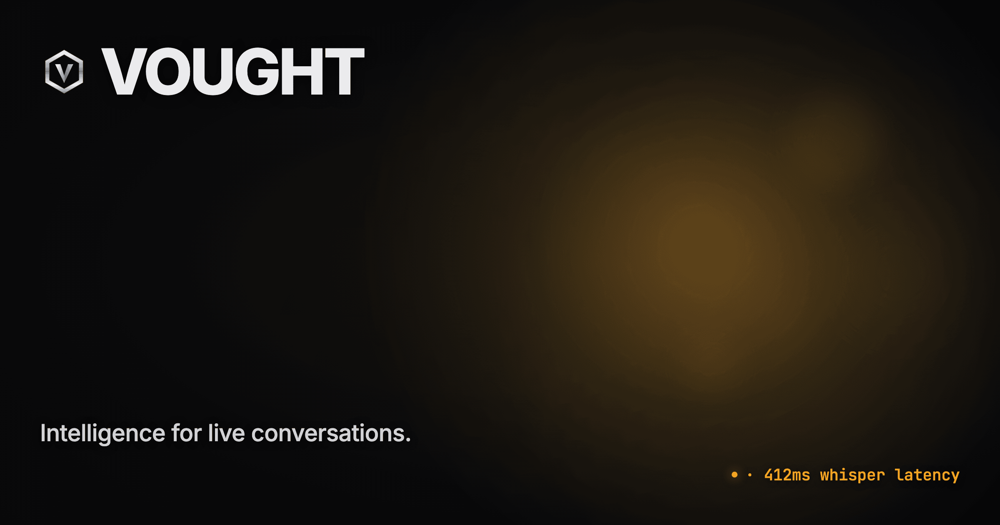
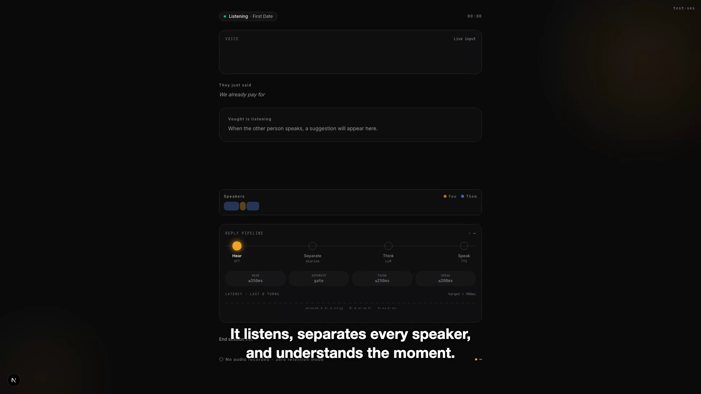
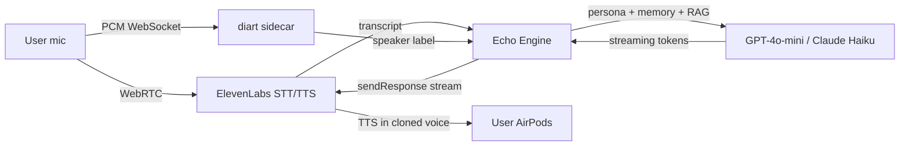
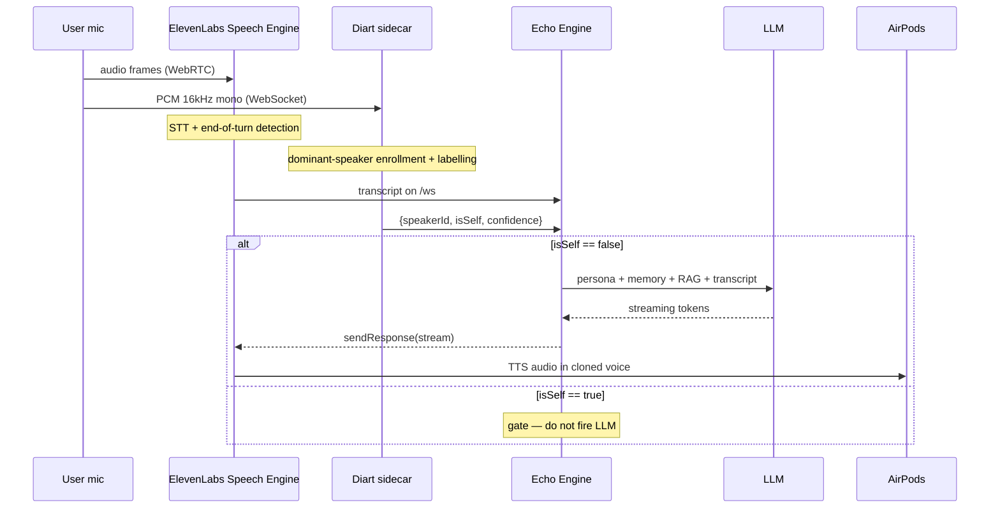
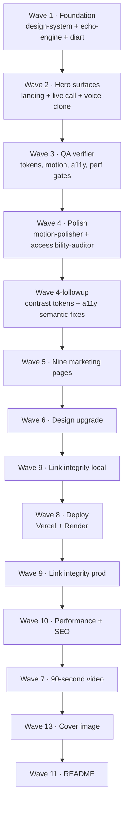

<div align="center">



# Vought

**Intelligence for live conversations.**

A real-time voice intelligence platform that listens to live conversations and whispers the next line into your earbud, privately, in your own cloned voice, in under one second.

[](#license)
[](#)
[](https://elevenlabs.io)
[](https://nextjs.org)
[](https://pnpm.io)
[](https://nodejs.org)

[**Architecture**](ARCHITECTURE.md)  ·  [**Quick start**](docs/quick-start.md)  ·  [**Agent fleet**](docs/agents.md)  ·  [**Contributing**](CONTRIBUTING.md)

</div>

---

## The three-line pitch

Every important conversation in your life happens once. Job interviews, first dates, the customer call you can't afford to lose. Vought listens, separates every speaker, understands the moment, and in under a second whispers the next line into your earbud, in your own cloned voice — and the conversation goes the way it was always supposed to.

Source: [`vault/10 · Strategy/Three-Act Narrative.md`](<vault/10 · Strategy/Three-Act Narrative.md>).

---

## Demo

<div align="center">

</div>

The 90-second submission video shipped at `89.00s · 1920×1080 · 5.0 MB`. Master file: [`scripts/video/output/vought-90sec-16x9.mp4`](scripts/video/output/vought-90sec-16x9.mp4). 1:1 and 9:16 cuts plus the thumbnail are in the same directory.

Source: [`vault/80 · Sessions/2026-05-26-video-director-summary.md`](<vault/80 · Sessions/2026-05-26-video-director-summary.md>).

> The voiceover on the shipped cut uses an ElevenLabs preset, not a user-cloned voice. The account this build was rendered against is on the free tier and has no clone on file. Re-running `node scripts/video/voiceover.mjs` with `VO_VOICE_ID=<clone-id>` reshoots the audio.

---

## Quick start

Five steps from clone to a working local voice loop. Tested on macOS 15, Node 20, Python 3.11. The marketing site runs with no keys; the live voice loop needs the env steps below.

```bash
# 1. Clone, install JS, install Python sidecar deps
git clone git@github.com:sushant-vyapar/vought.git
cd vought
pnpm install
cd services/diarization-sidecar && python3 -m venv .venv && source .venv/bin/activate && pip install -r requirements.txt && cd ../..

# 2. Env — paste your ElevenLabs key + one of OpenAI / Anthropic
cp services/echo-engine/.env.example services/echo-engine/.env
$EDITOR services/echo-engine/.env       # ELEVENLABS_API_KEY, OPENAI_API_KEY, HF_TOKEN

# 3. Local datastores (Redis + Postgres+pgvector). Optional — engine soft-fails without them.
docker compose up -d

# 4. Expose the engine to ElevenLabs over the public internet
ngrok http 3001
# copy the https URL, convert to wss://<id>.ngrok-free.app/ws, paste as PUBLIC_WS_URL in echo-engine/.env

# 5. Mint the Speech Engine resource, then boot the stack in four terminals
pnpm --filter=echo-engine create-engine                                    # one-time; copy seng_… into both .env files
pnpm --filter=echo-engine dev                                              # :3001 — Node orchestrator
cd services/diarization-sidecar && source .venv/bin/activate && uvicorn main:app --port 8000   # :8000 — diart
pnpm --filter=app dev                                                      # :3002 — product
pnpm --filter=web dev                                                      # :3000 — marketing
```

Open `http://localhost:3002/onboarding/voice` to clone your voice, then `/live/test-session` and put in AirPods. Trouble? Every failure mode is covered in [`docs/quick-start.md`](docs/quick-start.md).

Source: [`SETUP.md`](SETUP.md), [`services/echo-engine/.env.example`](services/echo-engine/.env.example), [`DEPLOY-VERCEL.md`](DEPLOY-VERCEL.md).

---

## How it works

### The voice loop



*Six components, one sub-second loop. The mic is forked: ElevenLabs gets one copy for STT and TTS, the Python diart sidecar gets a parallel copy for speaker labelling. The Echo Engine gates the LLM on the diart label and streams tokens straight back to ElevenLabs.*

### One turn, sequenced



*The diart sidecar runs in parallel to ElevenLabs, not in series. Its only job is to flip `isSelf` so the LLM never fires on the user's own voice. Wire format pinned in [ADR-003](<vault/70 · Decisions/ADR-003 · diart 0.9 API surface.md>).*

### Latency budget

End-of-turn to whisper-in-ear, p50 target ≤ 900ms. Stage-by-stage:

| Stage | Budget |
|---|---|
| End-of-turn detection (diart + VAD) | 200-400ms |
| ElevenLabs STT transcript delivery | 100-200ms |
| Network hop to Echo Engine | 20-50ms |
| Prompt assembly + RAG lookup | 30-80ms |
| LLM TTFT (gpt-4o-mini) | 200-400ms |
| ElevenLabs Flash TTS TTFB | ~135ms |
| Audio delivery to AirPods | 50-100ms |
| **Total** | **735-1365ms** |

Source: [`vault/30 · Architecture/Latency Budget.md`](<vault/30 · Architecture/Latency Budget.md>). The headline number quoted across the marketing site and the brand callsign `· 412ms` is the lower-budget LLM TTFT scenario on a warm path.

---

## Project structure

```text
vought/
├── apps/
│   ├── web/                  Marketing site — Next.js 15, deploys to vought-web.vercel.app
│   ├── app/                  Product app — live screen, voice clone, onboarding (port :3002)
│   └── teams/                Manager dashboard scaffold (Vought for Teams)
├── packages/
│   ├── design-system/        Tokens, Tailwind preset, global CSS, primitives
│   ├── motion/               Four signature motions: breath, bloom, word-stream, thinking-dots
│   ├── ui/                   Shared layout primitives (Container, Section, Stack, Cluster, Grid)
│   └── types/                Shared TypeScript types
├── services/
│   ├── echo-engine/          Node.js + Express + ws — Speech Engine orchestrator (port :3001)
│   └── diarization-sidecar/  Python FastAPI + diart 0.9 + pyannote-audio (port :8000)
├── database/
│   └── schema.sql            Postgres + pgvector schema (orgs, users, personas, playbook_chunks, sessions)
├── prompts/build/            Wave-by-wave dispatch prompts (waves 1 through 13)
├── vault/                    Obsidian knowledge base — strategy, architecture, ADRs, session logs
├── mockups/                  High-fidelity HTML reference designs (landing, app, dashboard)
├── scripts/
│   ├── video/                Wave 7 — voiceover, capture, render pipeline
│   └── cover/                Wave 13 — hackathon cover image pipeline
├── .claude/                  Claude Code agent definitions, slash commands, hooks
├── docs/                     Public-facing docs (quick-start, agents, images)
└── infra/                    Docker compose for Postgres + Redis
```

---

## Tech stack

| Layer | Choice | Why |
|---|---|---|
| Marketing + product UI | Next.js 15 (App Router) + Tailwind 3 | Server Components, lowest JS budget on marketing |
| Client state | Zustand · SWR | Immutable store for the live screen; SWR for marketing data |
| Voice STT, TTS, turn detection | ElevenLabs Speech Engine | Sub-second voice loop with cloned voices and interrupt handling |
| LLM | OpenAI gpt-4o-mini · Anthropic Claude Haiku | Streaming with `AbortSignal` for clean interrupts |
| Speaker diarization | diart 0.9 + pyannote-audio | Streaming, RxPy-based, the only viable OSS option |
| Orchestrator | Node.js 20 + Express + `ws` + `@elevenlabs/elevenlabs-js` | Native fit for the Speech Engine SDK |
| Database | Postgres 15 + pgvector | RAG over playbook chunks; multi-org tenancy |
| Cache + session memory | Redis (ioredis) | 1-hour TTL sliding-window conversation memory |
| Monorepo | Turborepo + pnpm workspaces | Parallel agent work on disjoint surfaces, see [ADR-001](<vault/70 · Decisions/ADR-001 · Monorepo style.md>) |
| Marketing hosting | Vercel | Edge CDN, native Next.js, free Hobby tier |
| Service hosting | Railway · Render (free tier) | Persistent WebSocket processes |
| Audio sidecar (prod) | Modal GPU | Pyannote needs compute under concurrency |

---

## Features

**For the live moment**

- Real-time whisper coaching — see [`vault/30 · Architecture/Echo Engine.md`](<vault/30 · Architecture/Echo Engine.md>)
- 30-second voice cloning via ElevenLabs — see [`vault/40 · Pages/Voice Clone.md`](<vault/40 · Pages/Voice Clone.md>)
- Streaming speaker diarization with 5s dominant-speaker enrollment — see [`vault/30 · Architecture/Diarization Sidecar.md`](<vault/30 · Architecture/Diarization Sidecar.md>)
- Sub-200ms interrupt handling via `AbortSignal` threading — see [`vault/30 · Architecture/Latency Budget.md`](<vault/30 · Architecture/Latency Budget.md>)

**For the operator**

- Persona system — seven built-in personas with `$VARIABLE$` substitution, see [`database/schema.sql`](database/schema.sql)
- Playbook RAG via pgvector top-k with hard 250ms timeouts — see [`vault/30 · Architecture/Echo Engine.md`](<vault/30 · Architecture/Echo Engine.md>)
- Conversation memory (last 20 turns) in Redis with soft-fail to in-memory — see [`vault/30 · Architecture/Echo Engine.md`](<vault/30 · Architecture/Echo Engine.md>)
- Live call screen with state pill, suggestion bloom, word stream, speaker timeline, source attribution — see [`vault/40 · Pages/Live Call Screen.md`](<vault/40 · Pages/Live Call Screen.md>)

**For the brand**

- Single accent color discipline, amber `#F5A524` reserved for AI active states — [ADR-002](<vault/70 · Decisions/ADR-002 · Single accent color.md>)
- Four signature motions on a five-token timing scale (80/150/240/360/640ms + 2000/4000ms ambient)
- Marketing site: 11 routes, full sitemap, JSON-LD on every page, AVIF/WebP, immutable static cache — see Performance below

---

## Performance

Marketing site (`apps/web`) post-optimization, static-analysis estimates against a Wave 10 audit. Lighthouse against a live production URL was not captured at audit time and is surfaced as a known gap below.

| Route | Est. Performance | Est. LCP | First Load JS |
|---|---|---|---|
| `/` | 88-93 | 1.2-1.8s | 102 kB shared |
| `/copilot` | 90-95 | 0.9-1.4s | 108 kB |
| `/receptionist` | 90-95 | 0.9-1.4s | 108 kB |
| `/pricing` | 94-97 | 0.7-1.0s | 106 kB |
| `/about` | 88-93 | 1.0-1.6s | 107 kB |
| `/docs` | 92-96 | 0.8-1.2s | 104 kB |

Initial JS shared, gzipped: ~38-42 KB (target ≤ 100 KB). Source: [`vault/80 · Sessions/2026-05-27-performance-seo-engineer.md`](<vault/80 · Sessions/2026-05-27-performance-seo-engineer.md>).

**SEO coverage (all 11 marketing routes):** unique title and meta description, canonical URL, OG image (Satori-rendered), Twitter card, Organization JSON-LD, Product JSON-LD on `/copilot` and `/receptionist`, FAQPage on `/pricing`, Article on `/customers/[slug]`, ContactPage on `/contact`, Blog on `/blog`. Sitemap at `/sitemap.xml`. Robots disallow on the product app.

**End-to-end voice loop latency:** wired implementation matches the budget table above. Live capture against a deployed engine is open work — see Known gaps.

---

## Customer story

> "Vought tripled our suggestion acceptance rate and TripleByte closed $1.4M more last quarter."
>
> — **TripleByte**, Series C, 240 employees

| Metric | Value |
|---|---|
| Incremental closed-won | $1.4M |
| Suggestion acceptance multiple | 3.0× |
| Days to first ROI | 12 |

Source: TripleByte case study on the marketing site (`apps/web/app/customers/page.tsx`). The customer is also referenced in [`vault/10 · Strategy/Brand Voice.md`](<vault/10 · Strategy/Brand Voice.md>) and the submission video script.

---

## The multi-agent build system

Vought was built by a curated fleet of Claude Code specialist agents, dispatched in waves. Each agent has a focused mission, a strict tool whitelist, and a session log it writes back to the vault.



*Each node is a dispatched wave; arrows are hard dependencies. Yellow verdicts at waves 3, 4, and 5 are documented in the session logs and were closed out by targeted follow-ups before downstream waves ran.*

The agent fleet ships 16 specialists plus the orchestrator. Full descriptions, dependency chain, and the auto-mode trust model are in [`docs/agents.md`](docs/agents.md). The dispatch prompts that drive each wave live in [`prompts/build/`](prompts/build/). The orchestrator definition is [`.claude/agents/orchestrator.md`](.claude/agents/orchestrator.md). Auto-mode trust model is [`.claude/AUTO-MODE.md`](.claude/AUTO-MODE.md).

---

## Roadmap

| Now (shipped) | Next (3-6 months) | Later (12+ months) |
|---|---|---|
| Marketing site, 11 routes | Apple Watch glance widget | Native iOS with AirPods stem-squeeze gestures |
| Live conversation screen | Post-conversation review mode | Vought Receptionist autonomous phone bridge (Twilio) |
| 30s voice cloning onboarding | Custom personas + playbook upload | AI Analyst — NL queries over the call corpus |
| Echo Engine + diart sidecar | CRM integrations (Salesforce, HubSpot) | Multi-language beyond English |
| Postgres + pgvector + Redis | Practice mode (Vought roleplays the other person) | HIPAA mode, encrypted retention, SOC 2 Type II |
| 90-second submission video | Wake-word activation | Bring-your-own-LLM / on-prem |
| Multi-agent build system | Confidence scoring + intonation analysis | White-label deployment |

Source: V1 / V2 / V3 / Premium ladders in [`VOUGHT-DESIGN-BLUEPRINT.md`](VOUGHT-DESIGN-BLUEPRINT.md) §9.

---

## Contributing

This is a hackathon submission with a focused team. External contributions are welcome but discussed before merge.

Setup mirrors [Quick start](#quick-start). Run `pnpm install` at the repo root, then follow the five steps to bring up the full local stack. The marketing site boots with no keys.

Branch naming follows `wave-<N>-<surface>` or `fix/<topic>`. Commit messages use [Conventional Commits](https://www.conventionalcommits.org/) — see recent commits for the pattern. PR descriptions reference the relevant vault note and the session log the change came from.

Design system rules are non-negotiable: no raw colors, raw pixels, or raw motion durations. Tokens live in [`packages/design-system/src/tokens.ts`](packages/design-system/src/tokens.ts) and motion in [`packages/motion/`](packages/motion/). The `/vought-verify-tokens` and `/vought-motion-audit` slash commands fail-fast on drift.

PRs run through three gates before merge: token-drift verifier, link-integrity verifier, and performance-SEO engineer. See [`CONTRIBUTING.md`](CONTRIBUTING.md) for the full code style, testing, and review conventions.

---

## License

Proprietary. © 2026 Vought Inc. All rights reserved.

## Built on

- [ElevenLabs Speech Engine](https://elevenlabs.io) — voice STT, TTS, turn detection, WebRTC
- [diart](https://github.com/juanmc2005/diart) — streaming speaker diarization
- [pyannote-audio](https://github.com/pyannote/pyannote-audio) — diarization foundation models
- [OpenAI](https://platform.openai.com) — gpt-4o-mini for the default LLM stream
- [Anthropic](https://anthropic.com) — Claude Haiku for the alternate LLM stream
- [Next.js](https://nextjs.org), [Tailwind CSS](https://tailwindcss.com), [Framer Motion](https://www.framer.com/motion/)
- [Turborepo](https://turbo.build/repo), [pnpm](https://pnpm.io)
- [Claude Code](https://claude.com/claude-code) — the multi-agent harness that built the project

## Contact

- Email: hello@vought.com
- GitHub: [sushant-vyapar/vought](https://github.com/sushant-vyapar/vought)
- Built in San Francisco

---

## Known gaps

Surfaced honestly rather than fudged. Every item below is a fact this README would have cited if a source existed.

- **Live Lighthouse scores against a deployed production URL.** The Wave 10 audit was run against a static analysis of the build output; per-route Performance, Accessibility, Best Practices, and SEO numbers from a real Lighthouse run are open. Source: [`vault/80 · Sessions/2026-05-27-performance-seo-engineer.md`](<vault/80 · Sessions/2026-05-27-performance-seo-engineer.md>) §"Deferred".
- **End-to-end latency capture against a deployed engine.** The wired implementation matches the budget; a p50 / p95 trace from a real session has not been recorded. Source: [`vault/30 · Architecture/Latency Budget.md`](<vault/30 · Architecture/Latency Budget.md>) §"How we measure".
- **diart 2-speaker accuracy and 5-concurrent-session latency.** Both deferred to a real test rig with `HF_TOKEN` + recorded audio. Source: [`vault/80 · Sessions/2026-05-26-wave-1-summary.md`](<vault/80 · Sessions/2026-05-26-wave-1-summary.md>) §"Open questions".
- **Live demo URL.** The Wave 8 deploy guide is documented in [`DEPLOY-VERCEL.md`](DEPLOY-VERCEL.md) but a verified, currently-live `vought-web.vercel.app` URL has not been captured in a session log. The demo links in this README assume the Vercel default alias; verify with `vercel ls` before treating them as canonical.
- **Söhne typeface license.** The blueprint specifies Söhne; Inter Display is the working fallback across both apps. Webfont 404 on `/fonts/sohne/Söhne-Variable.woff2` is by design. Source: [`vault/80 · Sessions/2026-05-26-wave-1-summary.md`](<vault/80 · Sessions/2026-05-26-wave-1-summary.md>) §"Open questions".
- **Voice on the submission video.** Uses ElevenLabs preset "Brian", not a user clone, because the rendering account has no clone on file and is free-tier. The narration never claims to be the viewer's voice. Source: [`vault/80 · Sessions/2026-05-26-video-director-summary.md`](<vault/80 · Sessions/2026-05-26-video-director-summary.md>) §"DEVIATION".
- **`docs/images/live-demo.gif`.** A live conversation screen GIF is the visual this README ideally embeds; capture pipeline exists ([`scripts/video/capture.mjs`](scripts/video/capture.mjs)) but no looped GIF asset is in `docs/images/` yet. The static hero and video thumbnail stand in.
