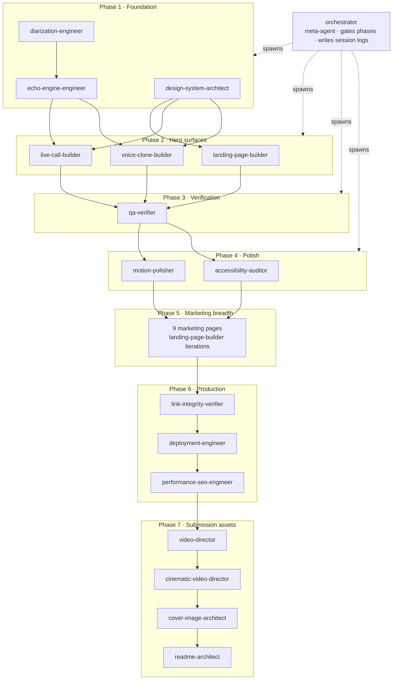

# The Agent Fleet · Vought

> Vought is built by a curated fleet of Claude Code specialist agents. Each has a focused mission, a strict tool whitelist, a clear deliverable, and a session log it writes back to the vault. Sixteen specialists plus the orchestrator that coordinates them.

This file is the canonical agent catalog. The dispatch prompts that drive each wave live in [`prompts/build/`](../prompts/build/). The agent definitions live in [`.claude/agents/`](../.claude/agents/). The session logs for every invocation live in [`vault/80 · Sessions/`](<../vault/80 · Sessions/>).

---

## Dependency graph

*Phases run in series; agents within a phase run in parallel. The orchestrator is the only agent allowed to spawn other agents. Agent failures do not auto-retry — the orchestrator surfaces them to the user and waits for a re-dispatch with a slimmer brief.*

---

## Spawning rules

1. **Agents within a wave run in parallel.** One `Task` call per agent inside a single response.
2. **Never spawn an agent whose dependencies are not green.** The orchestrator gates this.
3. **Each agent prompt is self-contained.** Pass every file path explicitly. Agents do not share working context.
4. **On agent failure, do not auto-retry.** Diagnose the failure (typically prompt-shape: too much required reading, scope too wide) and re-dispatch with a slimmer brief.
5. **Every agent writes a session log** to `vault/80 · Sessions/YYYY-MM-DD-<agent>.md` per the template at [`vault/99 · Templates/Session Template.md`](<../vault/99 · Templates/Session Template.md>).

Source: [`.claude/agents/README.md`](../.claude/agents/README.md), [`.claude/agents/orchestrator.md`](../.claude/agents/orchestrator.md).

---

## The orchestrator

**File:** [`.claude/agents/orchestrator.md`](../.claude/agents/orchestrator.md) · **Model:** opus · **Tools:** Task, Read, Write, Glob, Grep, Bash, TodoWrite

The meta-agent. Does not write code. Spawns the right agents at the right time, in the right order, with the right context, and maintains the project's continuity through session logs. The only agent allowed to spawn other agents.

**Reads before any action:**

1. [`CLAUDE.md`](../CLAUDE.md)
2. [`VOUGHT-DESIGN-BLUEPRINT.md`](../VOUGHT-DESIGN-BLUEPRINT.md) (the relevant phase)
3. [`vault/00 · Index/MOC · Master.md`](<../vault/00 · Index/MOC · Master.md>)
4. The three most recent session logs in `vault/80 · Sessions/`

**Hard constraints:** no code, no approving a wave that fails acceptance criteria, no skipping session logs, parallel spawn inside a single response.

---

## Phase 1 · Foundation

Three agents in parallel. Disjoint directories. Zero scope collisions. All three landed GREEN in [Wave 1](<../vault/80 · Sessions/2026-05-26-wave-1-summary.md>).

### design-system-architect

**File:** [`.claude/agents/design-system-architect.md`](../.claude/agents/design-system-architect.md)
**Owns:** [`packages/design-system/`](../packages/design-system/), [`packages/motion/`](../packages/motion/), [`packages/ui/src/primitives/`](../packages/ui/src/primitives/)
**Mission:** Build the foundational design system — tokens (color/type/spacing), Tailwind config, motion library with four signature animations, layout primitives.
**Dispatch prompt:** [`prompts/build/wave-1/design-system-architect.prompt.md`](../prompts/build/wave-1/design-system-architect.prompt.md)
**When to spawn:** at project foundation. Pre-requisite for all UI-touching agents.

### echo-engine-engineer

**File:** [`.claude/agents/echo-engine-engineer.md`](../.claude/agents/echo-engine-engineer.md)
**Owns:** [`services/echo-engine/`](../services/echo-engine/)
**Mission:** Build the Node.js Echo Engine — Speech Engine WebSocket attach, LLM orchestration with streaming + `AbortSignal` interrupt handling, persona system, conversation memory in Redis, playbook RAG via pgvector.
**Dispatch prompt:** [`prompts/build/wave-1/echo-engine-engineer.prompt.md`](../prompts/build/wave-1/echo-engine-engineer.prompt.md)
**When to spawn:** at project foundation. Pre-requisite for `live-call-builder` and `voice-clone-builder`.

### diarization-engineer

**File:** [`.claude/agents/diarization-engineer.md`](../.claude/agents/diarization-engineer.md)
**Owns:** [`services/diarization-sidecar/`](../services/diarization-sidecar/)
**Mission:** Build the Python FastAPI + diart streaming speaker diarization sidecar. 5-second dominant-speaker enrollment, real-time labelling, WebSocket broadcast of labels.
**Dispatch prompt:** [`prompts/build/wave-1/diarization-engineer.prompt.md`](../prompts/build/wave-1/diarization-engineer.prompt.md)
**When to spawn:** at project foundation. Pre-requisite for any "is the right speaker talking" feature.

---

## Phase 2 · Hero surfaces

Three agents in parallel. Each owns a disjoint app/route surface. All three landed GREEN in [Wave 2](<../vault/80 · Sessions/2026-05-26-wave-2-summary.md>).

### landing-page-builder

**File:** [`.claude/agents/landing-page-builder.md`](../.claude/agents/landing-page-builder.md)
**Owns:** [`apps/web/`](../apps/web/)
**Mission:** Build the marketing landing page following the 12-scene cinematic storyboard. Hero, customer logos, three pillars, live demo block, architecture diagram, customer story, security, pricing tease, CTA strip, footer.
**Dispatch prompt:** [`prompts/build/wave-2/landing-page-builder.prompt.md`](../prompts/build/wave-2/landing-page-builder.prompt.md)
**Re-used in:** [Wave 5](<../vault/80 · Sessions/2026-05-26-wave-5-summary.md>) for the nine marketing pages.

### live-call-builder

**File:** [`.claude/agents/live-call-builder.md`](../.claude/agents/live-call-builder.md)
**Owns:** [`apps/app/app/live/`](../apps/app/app/live/)
**Mission:** Build the live conversation screen — the hero of the entire product. State pill, suggestion bloom, word stream, speaker timeline, deal context, source attribution, confidence indicator, interruption handling.
**Dispatch prompt:** [`prompts/build/wave-2/live-call-builder.prompt.md`](../prompts/build/wave-2/live-call-builder.prompt.md)

### voice-clone-builder

**File:** [`.claude/agents/voice-clone-builder.md`](../.claude/agents/voice-clone-builder.md)
**Owns:** [`apps/app/app/onboarding/voice/`](../apps/app/app/onboarding/voice/), [`apps/app/app/settings/voice/`](../apps/app/app/settings/voice/), [`apps/app/app/api/voice-clone/`](../apps/app/app/api/voice-clone/)
**Mission:** Build the 30-second voice capture flow, ElevenLabs cloning API call, voice_id storage, hot-swap into the Speech Engine TTS config. The "wow" moment of the product.
**Dispatch prompt:** [`prompts/build/wave-2/voice-clone-builder.prompt.md`](../prompts/build/wave-2/voice-clone-builder.prompt.md)

---

## Phase 3 · Verification

Single agent. Read-only. Six audits. Landed YELLOW in [Wave 3](<../vault/80 · Sessions/2026-05-26-wave-3-summary.md>) — two audits PASSED, two DEFERRED for lack of installed dependencies, two surfaced real mechanical violations absorbed by Phase 4.

### qa-verifier

**File:** [`.claude/agents/qa-verifier.md`](../.claude/agents/qa-verifier.md)
**Mission:** Run verification gates — token drift audit, motion timing audit, axe-core accessibility, Lighthouse performance budget, signature motion phase-sync check.
**Dispatch prompt:** [`prompts/build/wave-3/qa-verifier.prompt.md`](../prompts/build/wave-3/qa-verifier.prompt.md)
**Behavior:** read-only. Surfaces violations with absolute file paths and line numbers. Does not fix.
**When to spawn:** after every implementation wave, before the polish wave.

---

## Phase 4 · Polish

Two agents in parallel. Motion-polisher landed GREEN; accessibility-auditor surfaced three CRITICAL contrast issues that were closed out in the [wave-4-followup](<../vault/80 · Sessions/2026-05-26-wave-4-followup-summary.md>).

### motion-polisher

**File:** [`.claude/agents/motion-polisher.md`](../.claude/agents/motion-polisher.md)
**Mission:** Final-pass agent for motion quality. Verifies every signature motion hits its exact spec, every page reveal staggers correctly, every hover/press behaves identically. Absorbs the QA Audit-2 fix list inline.
**Dispatch prompt:** [`prompts/build/wave-4/motion-polisher.prompt.md`](../prompts/build/wave-4/motion-polisher.prompt.md)
**Behavior:** in-place edits across `apps/web/` and `apps/app/`. Does not touch `packages/motion/` or `packages/design-system/` (those need design-system-architect signoff).

### accessibility-auditor

**File:** [`.claude/agents/accessibility-auditor.md`](../.claude/agents/accessibility-auditor.md)
**Mission:** Final accessibility pass — WCAG 2.2 AA verification, screen reader scripting, keyboard-only navigation test, color-independence check, exhaustive contrast audit.
**Dispatch prompt:** [`prompts/build/wave-4/accessibility-auditor.prompt.md`](../prompts/build/wave-4/accessibility-auditor.prompt.md)
**Behavior:** read-only. Surfaces violations with measured contrast ratios, not estimates.

---

## Phase 5 · Marketing breadth

[Wave 5](<../vault/80 · Sessions/2026-05-26-wave-5-summary.md>) dispatched nine agents in parallel — one per marketing route. Each agent was effectively a scoped `landing-page-builder` invocation. 7/9 shipped; 2 returned mid-investigation and were re-dispatched with slimmer prompts in [Wave 6](<../vault/80 · Sessions/2026-05-26-wave-6-design-upgrade-summary.md>).

Routes built: `/copilot`, `/receptionist`, `/customers`, `/security`, `/about`, `/contact`, `/blog`, `/platform`, `/pricing`.

---

## Phase 6 · Production

Three agents, one at a time. Each is the gate before the next.

### link-integrity-verifier

**File:** [`.claude/agents/link-integrity-verifier.md`](../.claude/agents/link-integrity-verifier.md)
**Mission:** Production navigation auditor. Crawls every page in the deployed (or local) Vought stack, validates that every link goes somewhere real, every CTA does what it says, no page is empty, no redirect is broken, the site graph has no dead ends or orphan pages.
**Dispatch prompt:** [`prompts/build/wave-9-link-integrity/`](../prompts/build/wave-9-link-integrity/)
**Behavior:** read-only. Outputs an absolute prioritized fix list with file paths and suggested re-dispatch prompts.
**When to spawn:** after every wave that touches routing; after deploy.

### deployment-engineer

**File:** [`.claude/agents/deployment-engineer.md`](../.claude/agents/deployment-engineer.md)
**Mission:** Production deployment specialist. Owns Vercel (Next.js apps), Railway / Render (Node + Python services), Neon (Postgres + pgvector), Upstash (Redis), and the post-deploy Speech Engine resource update. Runs verification smoke tests on production URLs.
**Dispatch prompt:** [`prompts/build/wave-8-deploy/`](../prompts/build/wave-8-deploy/)
**When to spawn:** after all build waves are green, before the video is filmed. The demo URL must be live and stable before media capture.

### performance-seo-engineer

**File:** [`.claude/agents/performance-seo-engineer.md`](../.claude/agents/performance-seo-engineer.md)
**Mission:** Production performance + SEO specialist. Audits Core Web Vitals (LCP / CLS / INP), Lighthouse scores, SEO signals, then applies the standard optimizations: `next/font`, `next/image`, sitemap.xml, robots.txt, JSON-LD schema, OG images, prefetch hints, caching headers, Tailwind purge tuning.
**Dispatch prompt:** [`prompts/build/wave-10-perf-seo/`](../prompts/build/wave-10-perf-seo/)
**Behavior:** unlike `qa-verifier` which only reports, this one fixes. Wave 10 dropped `/about` from 244 kB to 107 kB and `/docs` from 339 kB to 104 kB initial bundle.
**When to spawn:** after the build is functionally complete but before deploy, and again after deploy to verify production scores.

Session log: [`vault/80 · Sessions/2026-05-27-performance-seo-engineer.md`](<../vault/80 · Sessions/2026-05-27-performance-seo-engineer.md>).

---

## Phase 7 · Submission assets

Four agents, sequential. Each produces a single canonical artifact.

### video-director

**File:** [`.claude/agents/video-director.md`](../.claude/agents/video-director.md)
**Mission:** Produce the 90-second hackathon submission video by capturing screen recordings of every product surface via Playwright, generating a voiceover in the user's cloned voice via ElevenLabs TTS, composing the final MP4 via ffmpeg.
**Dispatch prompt:** [`prompts/build/wave-7-video/`](../prompts/build/wave-7-video/)
**Output:** [`scripts/video/output/vought-90sec-16x9.mp4`](../scripts/video/output/vought-90sec-16x9.mp4) — `89.00s · 1920×1080 · 5.0 MB`. Plus 1:1 and 9:16 cuts and a thumbnail.
**Session log:** [`vault/80 · Sessions/2026-05-26-video-director-summary.md`](<../vault/80 · Sessions/2026-05-26-video-director-summary.md>) — flags the voiceover deviation (preset, not clone).
**When to spawn:** only after all build waves are committed and the product runs end-to-end.

### cinematic-video-director

**File:** [`.claude/agents/cinematic-video-director.md`](../.claude/agents/cinematic-video-director.md)
**Mission:** Premium successor to `video-director`. Treats the prior video as a rough cut; produces a true cinematic upgrade. Uses Higgsfield AI for human B-roll generation, Gemini for edit decision-list synthesis, Whisper for free subtitle generation, ffmpeg `minterpolate` for 60fps smoothness, LUT-based color grading. Captures from production URLs, never localhost.
**Dispatch prompt:** [`prompts/build/wave-12-cinematic-video/`](../prompts/build/wave-12-cinematic-video/)
**When to spawn:** only after Wave 8 deploy is green and the production URL is stable. Wave 12 is the premium pass over Wave 7.

### cover-image-architect

**File:** [`.claude/agents/cover-image-architect.md`](../.claude/agents/cover-image-architect.md)
**Mission:** Produce the hackathon submission cover image — the single premium card that earns the click on the ElevenLabs Hacks leaderboard. Generates AI imagery via Midjourney / Imagen / Flux / DALL-E prompts (calibrated per-platform), composites with brand typography via HTML + Playwright for crisp text rendering. Outputs four aspect ratio variants (2:1, 16:9, 4:3, 1:1).
**Dispatch prompt:** [`prompts/build/wave-13-cover-image/`](../prompts/build/wave-13-cover-image/)
**Output:** [`scripts/cover/output/`](../scripts/cover/output/) — four variants, all under budget.
**Session log:** [`vault/80 · Sessions/2026-05-28-cover-image-architect.md`](<../vault/80 · Sessions/2026-05-28-cover-image-architect.md>).

### readme-architect

**File:** [`.claude/agents/readme-architect.md`](../.claude/agents/readme-architect.md)
**Mission:** Produce the public-facing GitHub README and supporting docs. Reads the entire project — blueprint, vault, code, mockups, session logs — and synthesizes a Series-A-grade README with mermaid architecture diagrams, hero imagery, performance metrics, quick start, project structure, tech stack, and clear next-steps for contributors and evaluators.
**Dispatch prompt:** [`prompts/build/wave-11-readme/`](../prompts/build/wave-11-readme/)
**Output:** [`README.md`](../README.md), [`ARCHITECTURE.md`](../ARCHITECTURE.md), [`CONTRIBUTING.md`](../CONTRIBUTING.md), [`docs/quick-start.md`](quick-start.md), [`docs/agents.md`](agents.md) (this file).
**When to spawn:** last. After every build, deploy, and video wave is committed.

---

## Agent summary table

| Agent | Phase | Owns | Behavior |
|---|---|---|---|
| `orchestrator` | * | Meta — spawns waves, gates phases, writes session logs | Coordinator |
| `design-system-architect` | 1 | `packages/design-system/`, `packages/motion/`, `packages/ui/` | Builder |
| `echo-engine-engineer` | 1 | `services/echo-engine/` | Builder |
| `diarization-engineer` | 1 | `services/diarization-sidecar/` | Builder |
| `landing-page-builder` | 2, 5 | `apps/web/` | Builder |
| `live-call-builder` | 2 | `apps/app/app/live/` | Builder |
| `voice-clone-builder` | 2 | `apps/app/app/onboarding/voice/`, `settings/voice/`, `api/voice-clone/` | Builder |
| `qa-verifier` | 3 | Read-only across all `apps/`, `packages/`, `services/` | Auditor |
| `motion-polisher` | 4 | In-place edits across `apps/web/`, `apps/app/` | Polisher |
| `accessibility-auditor` | 4 | Read-only across all UI surfaces | Auditor |
| `link-integrity-verifier` | 6 | Read-only crawler against local or production URLs | Auditor |
| `deployment-engineer` | 6 | `vercel.com`, `render.com`, `modal.com`, `neon.tech`, `upstash.com` | Operator |
| `performance-seo-engineer` | 6 | In-place edits on `apps/web/`, `apps/app/` | Polisher + fixer |
| `video-director` | 7 | `scripts/video/` | Producer |
| `cinematic-video-director` | 7 | `scripts/video/cinematic/` | Producer |
| `cover-image-architect` | 7 | `scripts/cover/` | Producer |
| `readme-architect` | 7 | `README.md`, `ARCHITECTURE.md`, `CONTRIBUTING.md`, `docs/` | Writer |

Total: 16 specialists + 1 orchestrator = 17 agent definitions in [`.claude/agents/`](../.claude/agents/).

---

## Auto-mode trust model

The repo runs with permissive defaults for the agent fleet. Reads, writes, and edits within the project are auto-approved. Standard CLIs (`pnpm`, `vercel`, `railway`, `ffmpeg`, `playwright`, `git`) are auto-approved. Deploy commands (`vercel --prod`, `railway up`) are auto-approved.

Hard-denied: `.env` files, `~/.ssh/`, `~/.aws/`, `sudo`, `rm -rf /`, `curl | sh`, `git push --force`, destructive database operations.

Full trust model at [`.claude/AUTO-MODE.md`](../.claude/AUTO-MODE.md).

---

## Reading order before invoking any agent

1. [`CLAUDE.md`](../CLAUDE.md) — project identity
2. [`VOUGHT-DESIGN-BLUEPRINT.md`](../VOUGHT-DESIGN-BLUEPRINT.md) — the constitution
3. The agent's own definition file in [`.claude/agents/`](../.claude/agents/)
4. The vault notes the definition lists as required reading
5. The three most recent session logs in [`vault/80 · Sessions/`](<../vault/80 · Sessions/>) — to understand what just happened

---

## See also

- [`README.md`](../README.md) — public entry point
- [`ARCHITECTURE.md`](../ARCHITECTURE.md) — technical deep dive
- [`CONTRIBUTING.md`](../CONTRIBUTING.md) — code style and PR workflow
- [`docs/quick-start.md`](quick-start.md) — extended setup walkthrough
- [`.claude/agents/README.md`](../.claude/agents/README.md) — original agent roster
- [`prompts/build/`](../prompts/build/) — every wave's dispatch prompts
